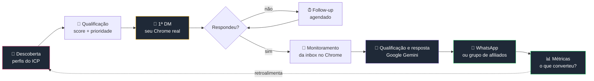

<div align="center">

# 🚀 Buscando 1 Milhão

### Um prompt. Um sistema comercial autônomo. Construído em público.

<br/>


<br/>


<br/>

## ⬇️ [**PROMPT.md**](PROMPT.md) ⬇️

**É esse arquivo. Preenche, cola no Codex, pronto.**

<br/>

**[O que é](#-o-que-é) · [Como funciona](#-como-funciona) · [Como usar](#-como-usar) · [Setup](#-setup-da-sua-máquina) · [Regras](#-regras-que-não-se-negocia)**

</div>

---

## 🎯 O que é

Um agente de IA que prospecta pelo Instagram: acha o lead, qualifica com Google Gemini, escreve a primeira mensagem, envia pelo navegador Chrome, monitora respostas, agenda follow-ups e encaminha o lead para o WhatsApp.

Roda 100% local. Seu banco, sua sessão, sua chave.

```
Observar → Decidir → Agir → Medir → Aprender → Adaptar
```

Aqui **não tem código pronto**. Tem o prompt que constrói o código. Você troca os `{{PLACEHOLDERS}}` pelo seu negócio, cola no Codex, e sai um sistema seu — não uma cópia do meu.

<br/>

## ⚙️ Como funciona



### Canal atual e evolução planejada

| Etapa | Canal | Motivo |
|:--|:--|:--|
| **Hoje** | Seu Chrome, sua sessão | O projeto usa Playwright conectado ao Chrome via CDP para descobrir perfis, enviar DMs e ler a inbox |
| **Futuro** | API oficial da Meta + webhook | Planejado para tornar o handoff e as conversas pós-resposta mais estáveis e auditáveis |

A integração oficial da Meta ainda não está implementada. Quando ela for adicionada, uma **trava de canal** deverá impedir que o navegador e a API escrevam no mesmo fio.

> **Estado atual:** não há integração efetiva com OpenAI nem webhook da Meta no código desta versão. Ambos fazem parte do roadmap.

<br/>

## 🚦 Como usar

### `1` Preenche o bloco de configuração

Abre o [**PROMPT.md**](PROMPT.md). No topo tem um bloco `CONFIGURAÇÃO` com uns 15 campos. Troca cada `{{PLACEHOLDER}}` pelo seu: nome, empresa, site, @ do Instagram, WhatsApp, oferta e quem é seu cliente ideal.

Dois campos merecem atenção:

- **`VERIFIED_CLAIMS`** — só o que você consegue provar hoje. É a única coisa que a IA pode afirmar pro lead.
- **`UNVERIFIED_CLAIMS`** — o que você *quer* dizer mas ainda não comprovou. Fica bloqueado até virar prova.

### `2` Cola no Codex

Copia o arquivo inteiro, do começo ao fim, e cola numa task do Codex.

> 💡 Codex cloud roda em container — ele **escreve** toda a camada de navegador e testa contra páginas simuladas, mas não alcança o seu Chrome. O prompt já diz isso pra ele, então ele entrega tudo e deixa o teste real documentado pra você rodar local.

### `3` Roda na sua máquina

Clona o que ele gerou, faz o [setup abaixo](#-setup-da-sua-máquina), e sobe:

```bash
pnpm install && pnpm dev
```

<br/>

## 🔧 Setup da sua máquina

<details>
<summary><b>🔑 Chave do Google Gemini</b></summary>

<br/>

1. Crie uma chave no Google AI Studio/Google Cloud para usar a API do Gemini.
2. Configure limites de uso e cobrança na conta Google para evitar custos inesperados.
3. Copie a chave e guarde-a em local seguro; ela pode não ser exibida novamente.

```bash
cp .env.example .env
# cola em GEMINI_API_KEY=sua_chave...
```

O `.env` já está no `.gitignore`. Nunca commita, nunca aparece em print ou vídeo.

**Vazou?** Revogue a chave no Google AI Studio/Google Cloud e gere outra. Nunca commite o `.env` nem publique chaves em prints ou vídeos.

</details>

<details>
<summary><b>🌐 Sessão do Instagram no seu Chrome</b></summary>

<br/>

Perfil **dedicado**, separado do seu pessoal. Isso resolve três coisas de uma vez: o agente nunca vê suas abas, seu Chrome normal continua livre, e o Chrome 136+ recusa debug no perfil padrão de qualquer jeito.

**macOS**

```bash
/Applications/Google\ Chrome.app/Contents/MacOS/Google\ Chrome \
  --remote-debugging-port=9222 \
  --remote-debugging-address=127.0.0.1 \
  --user-data-dir="$PWD/.chrome-profile"
```

**Linux**

```bash
google-chrome --remote-debugging-port=9222 --user-data-dir="$PWD/.chrome-profile"
```

**Windows (PowerShell)**

```powershell
& "C:\Program Files\Google\Chrome\Application\chrome.exe" `
  --remote-debugging-port=9222 `
  --user-data-dir="$PWD\.chrome-profile"
```

Nessa janela que abriu, entra no `instagram.com`, loga normal, resolve o 2FA. A sessão fica salva e sobrevive a reinício.

Testa:

```bash
curl -s http://127.0.0.1:9222/json/version
```

> ⚠️ **Segurança:** essa porta dá controle total sobre a sessão logada nesse perfil. Mantém em `127.0.0.1`, nunca `0.0.0.0`, e não roda em máquina compartilhada. O `.chrome-profile/` guarda seus cookies do Instagram — já está no `.gitignore` e não sai da sua máquina.

</details>

<br/>

## 🛡️ Regras que não se negocia

<details>
<summary><b>Como o agente não queima a conta</b></summary>

<br/>

| Controle | Padrão |
|:--|:--|
| DMs por dia | 30, com aquecimento gradual |
| Intervalo entre DMs | 90–240s aleatório |
| Janela de operação | 09:00–20:00, fuso configurável |
| Circuit breaker | Pausa tudo em erro anormal, restrição ou opt-out em alta |

Ritmo humano existe por **saúde da conta** — mesma disciplina de um SDR de verdade. Não tem fingerprint forjado, API privada nem tentativa de burlar bloqueio.

</details>

<details>
<summary><b>Como o agente não mente</b></summary>

<br/>

A IA só pode afirmar o que está em `VERIFIED_CLAIMS`. Qualquer coisa em `UNVERIFIED_CLAIMS` fica bloqueada até virar prova.

Ela nunca inventa taxa, condição, garantia ou superlativo, nunca promete aprovação de conta, e nunca finge ser cliente pra arrancar resposta.

</details>

<details>
<summary><b>Como o agente respeita quem não quer</b></summary>

<br/>

Pedido de parar é atendido na hora. O perfil entra em `do_not_contact` — permanente, sem follow-up, sem reentrada por outra campanha, por nenhum canal.

</details>

<details>
<summary><b>Como o custo não explode</b></summary>

<br/>

O código atual usa Google Gemini para a análise de perfis e geração de mensagens. O controle detalhado de tokens e orçamento ainda deve ser amadurecido.

O painel mostra **custo por lead** e **custo por cliente ativo** — sem isso não dá pra saber se a automação dá lucro.

</details>

<br/>

---

<div align="center">

**Este repositório é público de propósito.**

Pega o [PROMPT.md](PROMPT.md), troca os `{{PLACEHOLDERS}}`, e constrói o seu.

<br/>

⭐ Se isso te ajudou, deixa uma estrela e acompanha a jornada.

</div>
